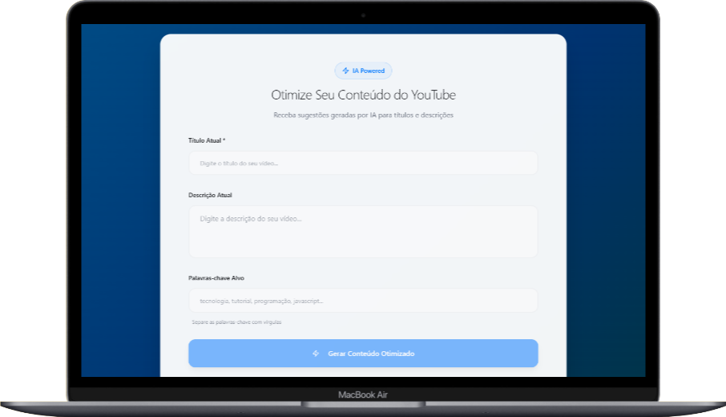

# 📌 Analisador de Títulos para YouTube/Blog – YouTube Optimizer AI  

  
  
  

---

## 🚀 Sobre o Projeto  
O **YouTube Optimizer AI** é um **Micro SaaS** criado no **Lovable** que ajuda criadores de conteúdo a **avaliar e melhorar títulos** de vídeos do YouTube, artigos de blog ou posts.  

Ele sugere melhorias de **palavras-chave** e indica se o título tem **alto ou baixo potencial de engajamento**, ajudando a conquistar **mais visualizações, alcance e inscritos**.  

---

## 🎯 Funcionalidades  
- Inserir título de vídeo/artigo/post.  
- Receber **avaliação de engajamento** (ex.: Forte, Médio, Fraco).  
- Sugestões de **palavras-chave** para otimizar o título.  
- Interface responsiva e moderna.  

---

## 🛠️ Tecnologias Utilizadas  
- **Lovable** (No-Code/Low-Code para desenvolvimento).  
- **TailwindCSS** (estilização).  
- *(Opcional)* API de IA (ex.: OpenAI) para sugestões mais inteligentes.  

---

## 📸 Demonstração  

### Print da Interface  

  
  
  
 

### Exemplo Antes/Depois  
**Antes:**  
`Meu vídeo de treino`  

**Depois (otimizado):**  
`🔥 5 Exercícios Simples para Definir o Corpo em 30 Dias | Guia Completo`  

---

## 🌐 Acesso ao Projeto  
👉 [Clique aqui para testar o app online](https://SEU-LINK-DO-APP-LOVABLE)  

---

## 📂 Como Usar  
1. Acesse o link do app.  
2. Insira o título que deseja analisar.  
3. Receba sugestões de otimização e avaliação de engajamento.  

---

## 📌 Próximos Passos / Melhorias Futuras  
- Salvar histórico de títulos analisados (Supabase).  
- Ranking de melhores títulos por engajamento.  
- Exportar relatório em PDF.  

---

✍️ **Autor:** [Seu Nome]  
📧 Contato: [seuemail@email.com] | [LinkedIn](https://linkedin.com/in/seu-usuario)  

---
