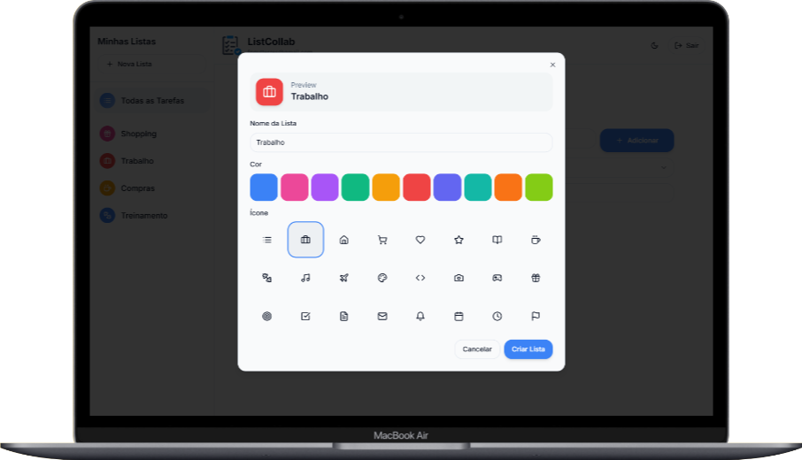
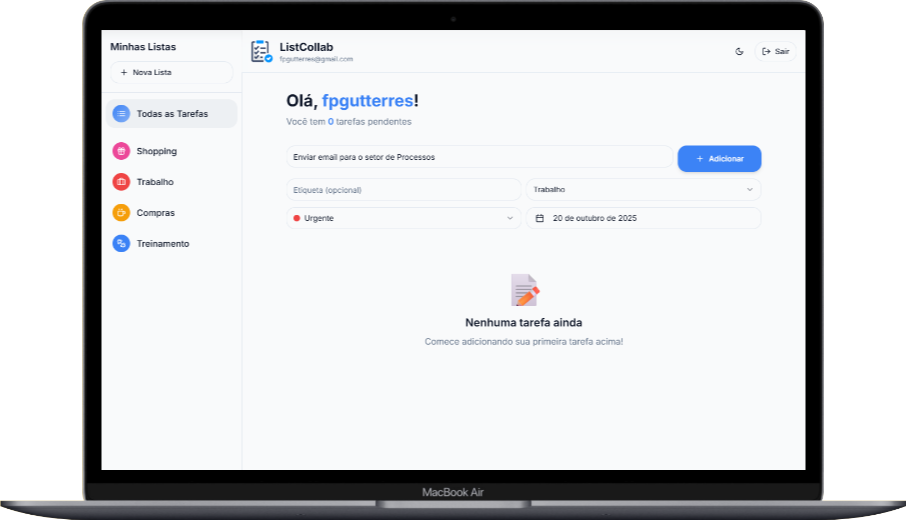
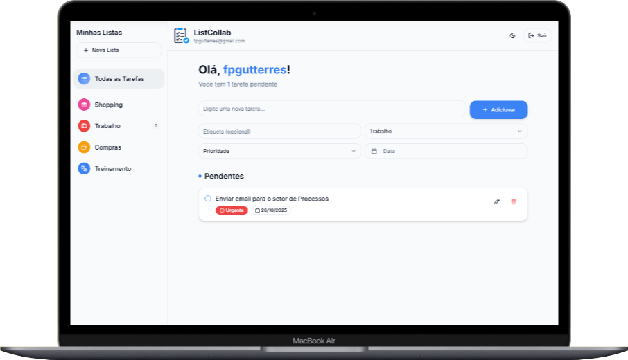

# ✅ Projeto 2 – To-Do App com Autenticação (ListCollab)  

  

---

## 🚀 Sobre o Projeto

O **CollabList** é um Mini SaaS de lista de tarefas online — simples, moderno e colaborativo.  
O usuário pode **criar conta, fazer login e gerenciar suas tarefas** com praticidade.  
Com o tempo, o app evoluiu para permitir **compartilhamento de listas entre casais e parceiros**, facilitando a comunicação e a organização do dia a dia.

Este projeto foi desenvolvido no **Lovable** com **Supabase** para autenticação e armazenamento de dados.

---

## 🎯 Funcionalidades

- 🔐 Criar conta e fazer login (autenticação via Supabase).  
- 📝 Adicionar novas tarefas.  
- ✅ Marcar tarefas como concluídas.  
- 🗂️ Visualizar lista de tarefas pendentes e concluídas.  
- 👥 Compartilhar listas com outro usuário (casal ou parceiro).  
- 📊 Dashboard simples com contagem de tarefas por status.  
- 🎨 Design minimalista estilo Apple (tema claro e escuro).  

---

## 🛠️ Tecnologias Utilizadas

- 🧩 **Lovable** – desenvolvimento visual e lógica do app.  
- 🧠 **Supabase** – autenticação, banco de dados e RLS (Row Level Security).  
- 🎨 **TailwindCSS** – estilização leve e responsiva.  
- ⚙️ **React** – interface dinâmica e moderna.  

---

## 📸 Demonstração  

### Print da Interface  

  

 

---

## 🌐 Acesso ao Projeto

👉 [Clique aqui para acessar o app](https://listcollab.lovable.app/) 

---

